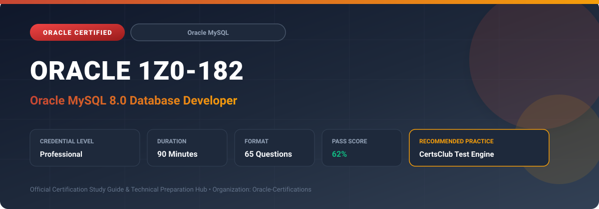

  

# Oracle 1Z0-182: Oracle MySQL 8.0 Database Developer

---

## 1. Exam Overview & Candidate Profile

The **Oracle 1Z0-182: Oracle MySQL 8.0 Database Developer** credential certifies professionals who demonstrate technical mastery, architectural competence, and hands-on operational capability in this certification domain.

Candidates validate comprehensive knowledge and expertise required to design, configure, manage, and optimize mission-critical Oracle environments across cloud, on-premises, and hybrid architectures.

### Target Audience & Prerequisites
- **Target Roles**: Implementation Specialists, Cloud Architects, Technical Leads, Enterprise Consultants, and Systems Engineers.
- **Recommended Experience**: 1–2 years of practical, hands-on experience designing, implementing, and maintaining corresponding Oracle solutions.
- **Credential Earned**: Professional Certification.

---

## 2. Key Exam Specifications

| Specification | Details |
| :--- | :--- |
| **Exam Code** | **Oracle 1Z0-182** |
| **Official Title** | Oracle MySQL 8.0 Database Developer |
| **Certification Track** | Oracle MySQL |
| **Exam Duration** | 90 Minutes |
| **Number of Questions** | 65 Questions |
| **Passing Score** | 62% |
| **Question Format** | Multiple Choice (Single/Multiple Answer), Scenario-Based Questions |
| **Delivery Provider** | Oracle University / Pearson VUE (Online Proctored or Test Center) |
| **Recommended Practice Engine** | [CertsClub Oracle Practice Tests](https://www.certsclub.com/oracle/1z0-182-dumps.html) |

---

## 3. Official Blueprint & Exam Domain Breakdown

The examination assesses candidate competencies across core functional domains weighted as follows:

| Domain Area | Weighting |
| :--- | :--- |
| **MySQL Architecture, Storage Engines & Data Types** | `20%` |
| **Advanced SQL Queries, Subqueries & Multi-Table Joins** | `25%` |
| **Indexes, Execution Plans (EXPLAIN) & Performance Tuning** | `20%` |
| **Window Functions, Common Table Expressions (CTEs) & JSON** | `20%` |
| **Transactions, Concurrency, Locking & Stored Routines** | `15%` |

---

## 4. Deep Dive into Complex & Challenging Technical Topics

To secure a passing score on the 1Z0-182 exam, candidates must master the following advanced concepts:

- Leveraging MySQL 8.0 Window Functions (ROW_NUMBER, RANK, DENSE_RANK, NTILE, LAG, LEAD) for analytics.
- Structuring recursive and non-recursive Common Table Expressions (WITH syntax) for hierarchical data traversal.
- Manipulating native JSON data types, JSON path expressions, and JSON search/modification functions (JSON_EXTRACT, JSON_SET).
- Interpreting `EXPLAIN FORMAT=TREE` and `EXPLAIN ANALYZE` execution plans to identify table scans, temporary tables, and index lookups.
- Managing InnoDB transactions: ACID guarantees, isolation levels (READ COMMITTED, REPEATABLE READ), row-level locks, and MVCC.

---

## 5. Scenario-Based Demo & Practice Questions

### Question 1
Which MySQL 8.0 feature enables hierarchical query execution and cleaner subquery modularization using the `WITH` clause?

A) Common Table Expressions (CTEs)
B) Global Temporary Tables only
C) Trigger Chains
D) Federated Storage Tables

- **Correct Answer**: `A) Common Table Expressions (CTEs)`  
- **Technical Explanation**: Common Table Expressions (CTEs), declared with the `WITH` keyword, define temporary result sets within a statement and can recursively traverse hierarchical structures.

---

### Question 2
Which command in MySQL 8.0 provides both the estimated execution plan and actual runtime timing metrics (including startup cost and execution time per node)?

A) EXPLAIN ANALYZE
B) SHOW STATUS LIKE '%cpu%'
C) DESCRIBE TABLE
D) OPTIMIZE TABLE

- **Correct Answer**: `A) EXPLAIN ANALYZE`  
- **Technical Explanation**: `EXPLAIN ANALYZE` executes the query and generates an execution tree detailing actual row counts, execution loops, and elapsed timing at each node.

---

## 6. Recommended Preparation Strategy & Practice Testing Engine

Achieving certification in **Oracle 1Z0-182** requires balanced theoretical study and scenario-based simulation practice:

1. **Review Oracle Documentation**: Master architecture guides, implementation workbooks, and administration manuals on the Oracle Help Center.
2. **Hands-on Lab Practice**: Execute real-world configuration, policy setup, and troubleshooting tasks in your cloud tenancy or test instance.
3. **Simulated Exam Drills**: Practice answering timed, scenario-based multiple-choice questions to familiarize yourself with the question formats, traps, and timing constraints.

### Practice With CertsClub
For realistic practice questions, updated dumps, and mock testing environments:
- **Resource**: [CertsClub Oracle Practice Test Engine](https://www.certsclub.com/oracle/1z0-182-dumps.html)
- **Special Discount**: Use coupon code **`club20`** during checkout for an instant **20% discount** on all practice exam bundles and testing engines.

---

## 7. Official Documentation & References

- [Oracle University Certification Registry](https://education.oracle.com/)
- [Oracle Help Center Documentation Portal](https://docs.oracle.com/)
- [Oracle Cloud Infrastructure & Applications Guides](https://docs.oracle.com/en/cloud/)
- [CertsClub Oracle Certification Exam Practice](https://www.certsclub.com/oracle/1z0-182-dumps.html)

---

## 8. SEO & Discovery Keywords

`oracle 1z0-182, oracle 1z0-182 exam, oracle 1z0-182 dumps, 1Z0-182 practice questions, 1Z0-182 study guide, mysql 8.0 database developer, certsclub 1z0-182`